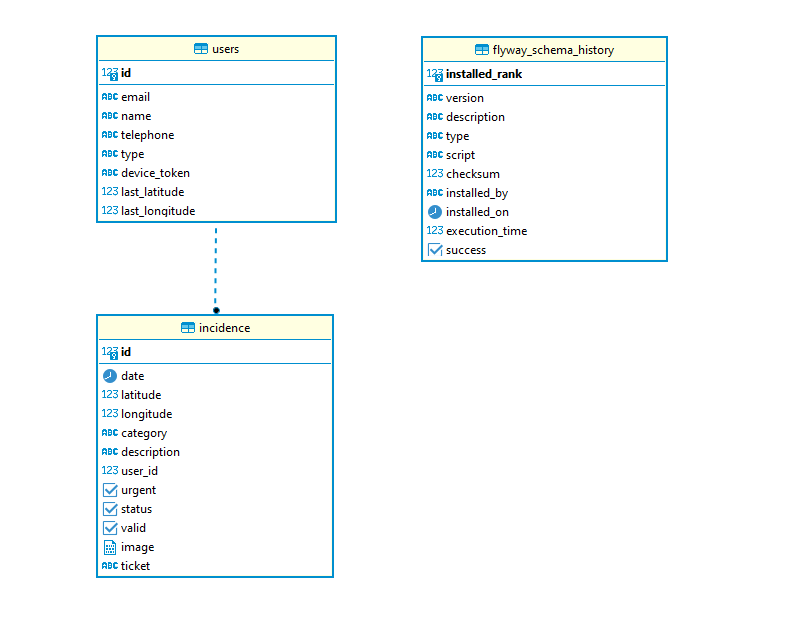

## Saveblu API

### Documentação da Api com o Swagger

Acesse o endereço:

[http://localhost:8080/swagger-ui/index.html](http://localhost:8080/swagger-ui/index.html)

### Diagrama de Classes


### Diagrama ER



### Gerar arquivo war

```
mvn clean package
```

